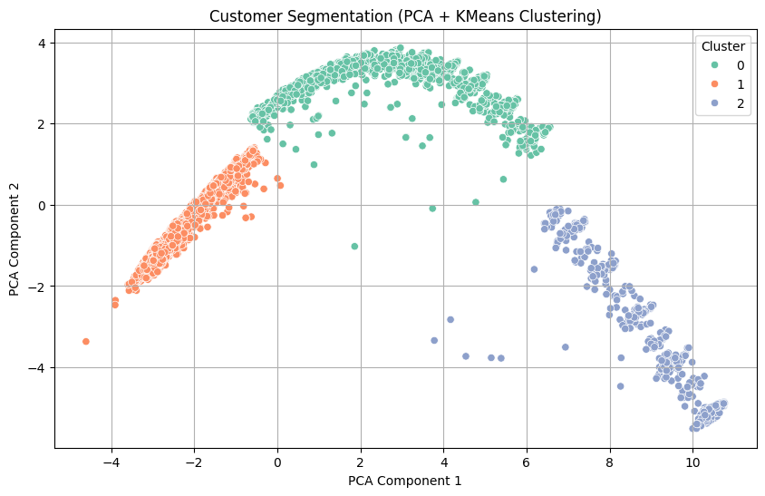
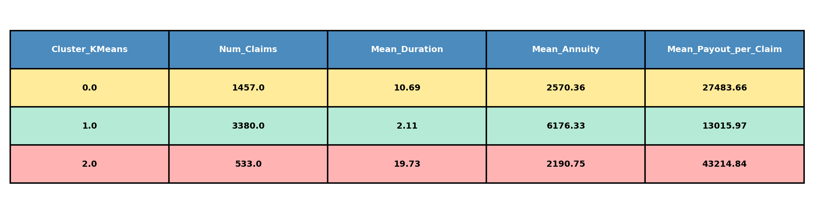
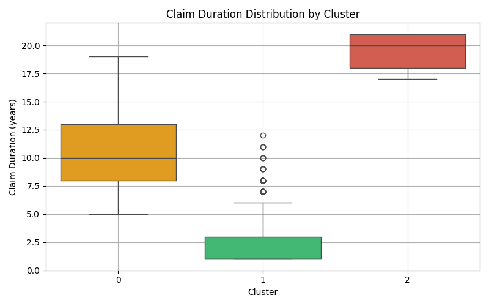
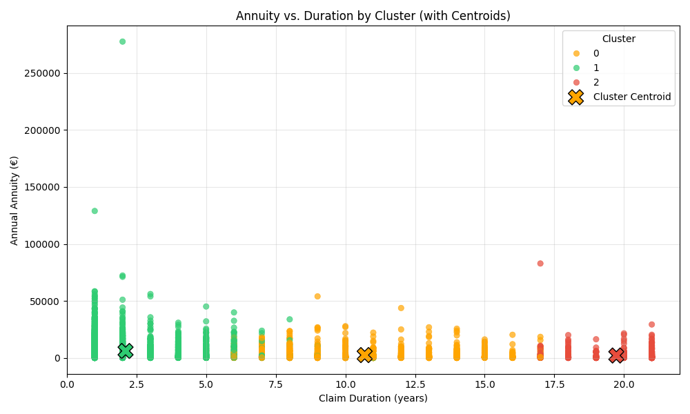
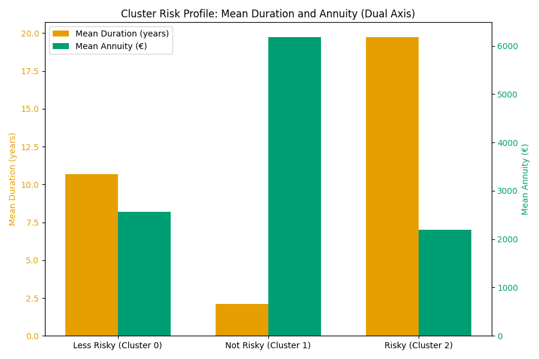
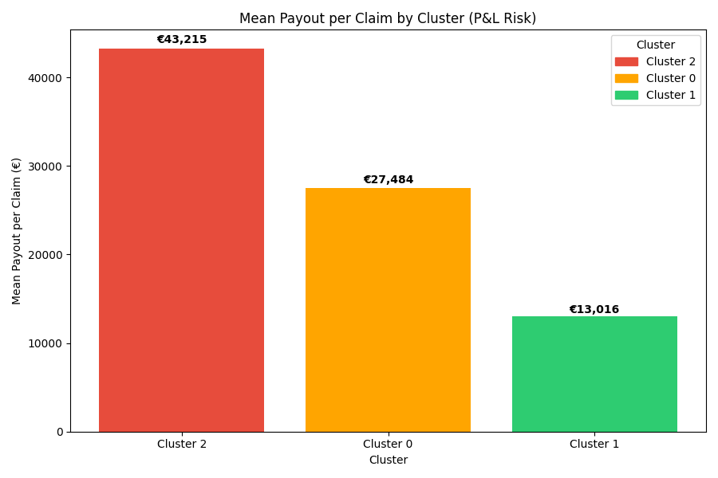
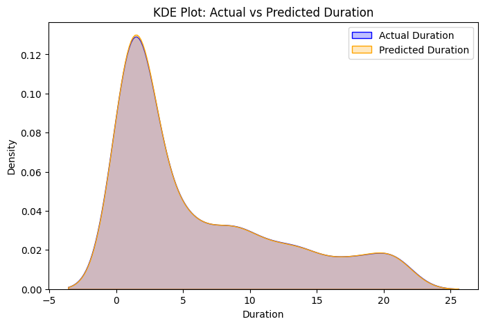
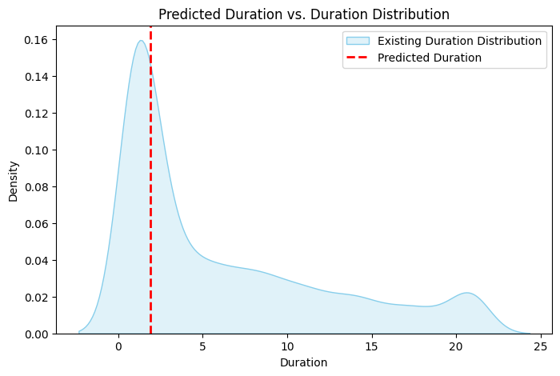

Machine learning solutions for Allianz Benelux SA: customer segmentation using K-Means and PCA; predictive modeling with supervised learning, feature engineering, data preprocessing, model evaluation.

# Allianz Insurance Analytics: Customer Segmentation & Predictive Modeling

Welcome to the Allianz Insurance Analytics repository—a showcase of advanced machine learning applications in the insurance industry. Developed as a case study for Allianz Benelux SA, this project demonstrates the power of data science in transforming insurance operations.

---

## Table of Contents

- [Project Overview](#project-overview)
- [Model 1: Customer Segmentation (Clustering)](#model-1-customer-segmentation-clustering)
- [Model 2: Predictive Modeling (Supervised Learning)](#model-2-predictive-modeling-supervised-learning)
- [How to Use](#how-to-use)
- [License](#license)
- [Intended Audience](#intended-audience)
- [Contact](#contact)

## Project Overview

The insurance industry faces unprecedented competition and complex risks. Harnessing data science allows insurers like Allianz Benelux SA to:

- Optimize pricing and product design
- Enhance customer targeting and retention
- Flag high-risk claims early for proactive management
- Make informed, strategic decisions based on actionable analytics

This repository brings together two robust machine learning solutions:

---

## Model 1: Customer Segmentation (Clustering)

### Objective
Segment insurance customers into distinct groups based on risk and claim characteristics, enabling tailored business strategies and optimized resource allocation.

### Techniques Used
- Data preprocessing: Handling missing values, encoding, scaling
- Correlation-based feature selection
- Dimensionality reduction with PCA
- K-Means clustering
- Cluster evaluation with silhouette score
- Cluster profiling for actionable business insights

### Key Results & Visualizations

#### 1. Customer Segmentation Visualization



*Scatter plot of customer clusters in PCA-reduced space, showing distinct groups for targeted action.*

#### 2. Cluster Profile Summary Table



*Table comparing segment size, mean claim duration, annuity, and payout—essential for business strategy.*

#### 3. Claim Duration by Cluster



*Boxplot analysis of claim durations across segments, revealing risk differences.*

#### 4. Annuity vs. Duration by Cluster



*Scatter plot mapping annuity against claim duration, colored by cluster with centroids highlighted.*

#### 5. Cluster Risk Profile: Mean Duration and Annuity



*Bar chart for average claim duration and annuity by segment.*

#### 6. Mean Payout per Claim by Cluster



*Mean payout per claim by cluster, highlighting which segments drive costs.*

---

## Model 2: Predictive Modeling (Supervised Learning)

### Objective
Predict insurance claim risk at the individual level, empowering Allianz to proactively identify and manage high-risk claims.

### Techniques Used
- Data preprocessing and feature engineering
- Model selection (Logistic Regression, Random Forest, etc.)
- Hyperparameter tuning
- Model evaluation (R2 Score on Test Set, RMSE on Test Set, Mean Absolute Error (MAE), Mean Squared Error (MSE))
- Visualization of results and feature importance
#### 1. Actual Durations VS Perdicted Duration



*Table comparing actual duration vs perdicted duration *
#### 2. Duration VS Density



*Table comparing actual duration vs perdicted duration *
---

## License

This project is licensed under the Apache License 2.0 - see the [LICENSE](LICENSE) file for details.

The Apache License 2.0 is a permissive license that allows you to:
- Use the software for any purpose
- Modify the software
- Distribute the software
- Sublicense the software
- Grant a patent license

For more details about the terms and conditions, please refer to the [LICENSE](LICENSE) file.

Last updated: 2025-05-25 12:03:17 UTC

---

## How to Use

1. **Clone the repository and install dependencies:**
   ```bash
   git clone https://github.com/yourusername/allianz-insurance-analytics.git
   cd allianz-insurance-analytics
   pip install pandas numpy scikit-learn matplotlib seaborn
